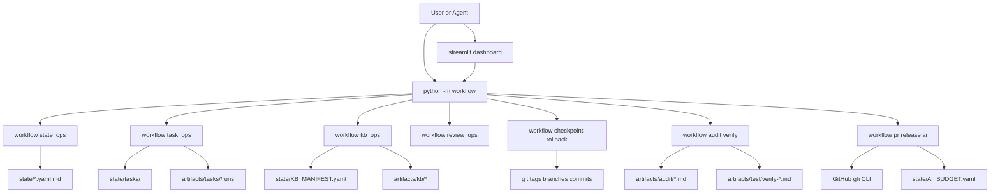
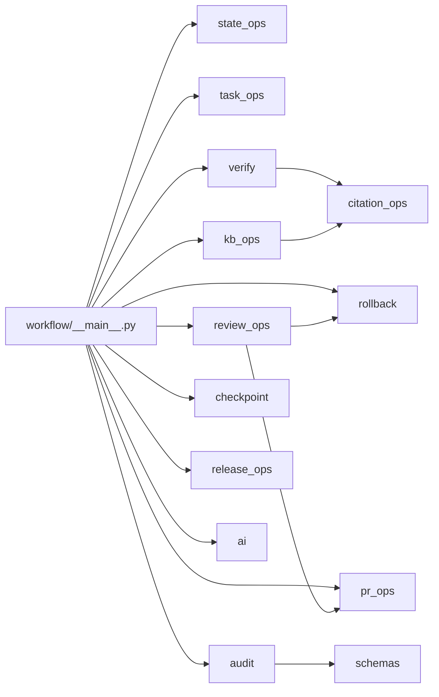

# Client Agentic Workflow（中文主文档）

> 一个面向研究与工程协作的可审计（auditable）、可验证（verifiable）、可回档安全（rollback-safe）workflow 系统。

## 目录
- [1. 项目概览（Overview）](#1-项目概览overview)
- [2. 术语表（Glossary）](#2-术语表glossary)
- [3. 架构总览（Architecture）](#3-架构总览architecture)
- [4. 核心机制原理（How It Works）](#4-核心机制原理how-it-works)
- [5. 代码框架详解（Code Framework）](#5-代码框架详解code-framework)
- [6. 用户侧使用方式（User Guide）](#6-用户侧使用方式user-guide)
- [7. 质量门禁（Quality Gates）](#7-质量门禁quality-gates)
- [8. 示例实战（T-0015 + RL 项目）](#8-示例实战t-0015--rl-项目)
- [9. 给 ChatGPT 的评估模板（Evaluation Pack）](#9-给-chatgpt-的评估模板evaluation-pack)
- [10. 已知限制与演进路线（Limitations & Roadmap）](#10-已知限制与演进路线limitations--roadmap)
- [11. 附录入口（Appendix）](#11-附录入口appendix)

## 1. 项目概览（Overview）
### 1.1 目标
本仓库用于持续构建一个 **Research + Engineering 协作中台**，核心目标是：
1. 每条关键结论都能追溯到 evidence 与 verification。
2. 每个任务都能记录 Plan/Do/Check/Act（PDCA）过程。
3. 人类审批（human-in-the-loop）具备一等地位，Reject 可触发安全级联回退。
4. 任意时间点可通过 checkpoint + rollback 做可控恢复。

### 1.2 设计原则
- `Truth-on-disk`：关键状态必须落盘到 `state/` 或 `artifacts/`。
- `Evidence-first`：结论先有证据、再有声明。
- `Verification-required`：核心结论必须附可运行验证。
- `Rollback-safe by default`：默认安全回档（git revert），避免破坏性历史重写。
- `Human authority`：Approve/Rework/Reject 由人类最终裁决。

### 1.3 适用场景
- AI 协同开发流程治理。
- 研究推导 + 实验 +工程发布一体化管理。
- 需要可审计交付（可对外展示过程质量）的项目。

### 1.4 非目标（Non-goals）
- 不把仓库变成重型平台（当前是轻量文件驱动架构）。
- 不引入外部向量数据库（KB 当前使用倒排索引）。
- 不替代 GitHub 原生 PR 审核机制，而是增强其可追溯性。

## 2. 术语表（Glossary）
- `workflow`：本仓库的 CLI/模块化执行系统。
- `audit`：静态一致性与治理完整性检查（P0/P1/P2 分级）。
- `verify`：动态可运行验证（pytest + derivation checks + task/KB checks）。
- `checkpoint`：某个稳定快照的 tag + 状态记录。
- `rollback`：回退机制，默认 safe 模式（revert 链）。
- `review queue`：待审批任务队列（pending -> approve/rework/reject）。
- `reject cascade`：Reject 后触发的级联重启机制。
- `run_meta`：任务执行元数据，记录 command/env/inputs/outputs/logs。
- `citation`：证据引用（`path#Lx`）及可选 `source_sha256` 校验。
- `KB ingest/query`：知识库入库与检索流程。
- `release automation`：跨仓库发布自动化（bootstrap/publish/pr）。

## 3. 架构总览（Architecture）
### 3.1 顶层目录地图
- `workflow/`：CLI 与业务核心模块。
- `state/`：可审计状态层（tasks/results/review/registry/budget）。
- `artifacts/`：验证、审计、KB、任务运行输出。
- `docs/`：治理、数据模型、流程文档。
- `tests/`：功能与回归测试。
- `dashboard/`：Streamlit 管理面板。
- `projects/`：项目级示例（当前含 RL Gridworld Q-learning）。

### 3.2 数据流（Data Flow）


### 3.3 模块关系（Module Relationship）


## 4. 核心机制原理（How It Works）
### 4.1 固定执行循环：PDCA
1. `Plan`：目标、约束、验收标准写入任务上下文。
2. `Do`：执行命令并生成 `run_meta`、输出 artifacts。
3. `Check`：执行 `verify` 与 `audit`，确认正确性与合规性。
4. `Act`：审批推进、返工、或回档。

### 4.2 Review Queue 与审批语义
- `Approve`：任务状态更新为 `done`。
- `Rework`：任务状态更新为 `blocked`。
- `Reject`：触发 reject cascade。

### 4.3 Reject Cascade（关键安全链路）
当执行 `review-queue reject --anchor <tag|commit>` 时，系统会：
1. 对被拒任务置 `blocked`。
2. 递归重置依赖任务为 `todo`。
3. 建立 `rollback/<anchor>-<timestamp>` 分支。
4. 对 `(anchor..HEAD]` 执行 `git revert`。
5. 降级锚点后不可信 `KEY_RESULTS` 为 `proposed`。
6. 自动关闭 superseded source PR（如可判定）。
7. 写入 `state/HUMAN_REVIEW_LOG.md` 与 `state/STATE.md`。

### 4.4 Checkpoint / Rollback 双模式
- `safe rollback`：默认模式，创建 rollback 分支并逐提交 revert。
- `hard rollback`：需确认短语 `I_UNDERSTAND_HARD_RESET`，才允许 `git reset --hard`。

### 4.5 Task-level Structured Record
每个任务在 `state/tasks/<task_id>/` 下具备标准化记录：
- `brief.yaml`（目标/范围/约束/assumptions）
- `worklog.md`（PDCA 行为轨迹）
- `evidence_map.yaml`（claim -> evidence -> verification）
- `handoff.yaml`（角色交接）
- `run_index.yaml`（run 列表）

执行命令可通过：
```bash
python -m workflow task run --id T-0015 --role implementer --cmd "python -m workflow verify"
```
系统自动写入：
- `artifacts/tasks/<task_id>/runs/<run_id>/run_meta.yaml`
- `stdout.log` / `stderr.log`
- `state/tasks/<task_id>/run_index.yaml`

### 4.6 Citation Integrity
- 规范格式：`path#L<line>` 或 `path#L<start>-L<end>`。
- 校验维度：路径存在、行号有效、`source_sha256` 匹配。
- hash mismatch 时应标记 `uncertain`，不得当作 verified 证据。

### 4.7 KB Ingest / Query
- `ingest`：扫描源文件 -> chunk -> summary -> inverted index -> manifest 更新。
- `query`：基于 token 倒排索引召回 chunk，返回 cite + source_sha256 + snippet。

示例：
```bash
python -m workflow kb ingest --task T-0015 --src docs --src literature
python -m workflow kb query --task T-0015 --q "rollback safety" --top-k 8
```

### 4.8 AI Budget Guardrails
- 配置文件：`state/AI_CONFIG.yaml`。
- 账本文件：`state/AI_BUDGET.yaml`。
- 模型路由：`plan/audit -> pro`，`task(type) -> pro/codex`。
- 预算策略：80% 预警、100% 降级 `hard_limit_model`（默认 `gpt-5-mini`）。
- 支持自动 fallback chain（模型不可用时按路由链回退）。
- 无 API key 时生成 pending 报告，不中断流程。
- Prompt Composer（V2）：
  - 模块清单：`prompts/registry.yaml`
  - 全局模块：`prompts/modules/*`
  - 项目覆盖：`projects/<slug>/prompts/registry.yaml`（同 ID 覆盖全局）
  - 参数：`--response-profile`、`--project`、`--viz`、`--prompt-budget`
  - `--prompt` 手工输入优先，提供后会跳过 composer。

## 5. 代码框架详解（Code Framework）
### 5.1 `workflow/` 核心层
- `__main__.py`：CLI 路由与参数解析总入口。
- `state_ops.py`：state YAML/MD 读写与原子化更新。
- `audit.py`：审计聚合器（schema + integrity + governance）。
- `verify.py`：动态验证执行器（tests + checks + replay）。
- `review_ops.py`：审批动作与 reject cascade 编排。
- `rollback.py` / `checkpoint.py`：回档与快照。
- `task_ops.py`：任务运行元数据与结构化任务记录。
- `kb_ops.py` / `citation_ops.py`：知识库与引用完整性。
- `pr_ops.py` / `release_ops.py`：PR 与跨库发布自动化。
- `ai.py`：Responses API 调用与预算守卫。
- `prompt_composer.py`：模块化 prompt 组装与预算裁剪。

### 5.2 `state/` 治理层
- `TASKS.yaml`：任务队列及状态机。
- `KEY_RESULTS.yaml`：关键结论及证据/验证映射。
- `REVIEW_QUEUE.yaml`：待审项。
- `PROJECT_REGISTRY.yaml`：多项目注册信息。
- `PR_REGISTRY.yaml`：PR 跟踪（source/release）。
- `KB_CONFIG.yaml` / `KB_MANIFEST.yaml`：KB 配置与文档清单。
- `STATE.md`：可读状态快照与历史上下文。
- `HUMAN_REVIEW_LOG.md`：人类审批留痕。

### 5.3 `dashboard/` 操作面板
`streamlit run dashboard/app.py` 提供六个 tab：
- Overview
- Tasks
- Review Queue
- Checkpoints
- Audit & Verify
- Jobs & AI

并对关键 git 写操作提供确认 guard，降低误操作风险。

### 5.4 `tests/` 回归防线
当前测试覆盖重点包括：
- schema 正确性
- checkpoint/rollback 行为
- reject cascade
- task run_meta
- citation validity
- KB ingest/query
- release automation
- RL experiment 回归指标

### 5.5 `projects/` 项目级示例
`projects/rl-gridworld-qlearning/` 展示从推导、实验、验证到发布的完整闭环。

## 6. 用户侧使用方式（User Guide）
### 6.1 环境准备
```bash
python3 -m pip install -r requirements.txt
```

### 6.2 Daily Loop（推荐）
```bash
python3 -m workflow sync
python3 -m workflow status
python3 -m workflow tasks list
python3 -m workflow review-queue sync
python3 -m workflow verify
python3 -m workflow audit
```

### 6.3 常见场景命令模板
#### 场景 A：新建并推进任务
```bash
python3 -m workflow tasks add --title "补齐 citation 校验" --type code --priority P0 --owner codex --status in_progress --acceptance "新增测试"
python3 -m workflow tasks update --id T-0016 --status waiting_review
python3 -m workflow review-queue sync
```

#### 场景 B：审批与回退
```bash
python3 -m workflow review-queue list
python3 -m workflow review-queue approve --id RQ-0011 --reviewer human --notes "ok"
python3 -m workflow review-queue reject --id RQ-0011 --anchor cp-20260220-1918-rl-gridworld-qlearning-c --reviewer human --notes "baseline issue"
```

#### 场景 C：checkpoint 与 rollback
```bash
python3 -m workflow checkpoint --summary "phase-c-stable" --key-result KR-0009
python3 -m workflow checkpoints
python3 -m workflow rollback --mode safe --anchor cp-20260220-1918-rl-gridworld-qlearning-c
```

#### 场景 D：KB 与 task run_meta
```bash
python3 -m workflow kb ingest --task T-0015 --src docs --src derivations
python3 -m workflow kb query --task T-0015 --q "workflow verify" --top-k 3
python3 -m workflow task run --id T-0015 --role critic --cmd ".venv/bin/python -m workflow verify"
```

#### 场景 E：发布自动化
```bash
python3 -m workflow release bootstrap --project rl-gridworld-qlearning --visibility public
python3 -m workflow release publish --project rl-gridworld-qlearning
python3 -m workflow release pr --project rl-gridworld-qlearning --title "release: sync" --body "sync from source"
```

#### 场景 F：Task-Aware AI 路由
```bash
python3 -m workflow ai plan
python3 -m workflow ai audit
python3 -m workflow ai task --id T-0015 --intent design
python3 -m workflow ai task --id T-0015 --intent run --output artifacts/tasks/T-0015/ai/custom.md

# 启用 profile/project/viz/budget
python3 -m workflow ai plan --response-profile qa_zh --project rl-gridworld-qlearning --viz auto --prompt-budget high
python3 -m workflow ai audit --response-profile audit_cn --project rl-gridworld-qlearning --viz on --prompt-budget high
python3 -m workflow ai task --id T-0015 --intent run --response-profile paper_en --project rl-gridworld-qlearning --viz auto --prompt-budget high
```

## 7. 质量门禁（Quality Gates）
### 7.1 `pytest`
- 目标：单元/集成/回归行为正确。
- 命令：
```bash
.venv/bin/python -m pytest -q
```

### 7.2 `workflow verify`
- 目标：运行时验证闭环。
- 额外检查：task 记录结构、citation 完整性、KB query smoke、run_meta replay。
- 输出：`artifacts/test/verify-*.md`。

### 7.3 `workflow audit`
- 目标：治理与可追溯性审计。
- 分级：`P0`（阻断）、`P1`（高优先）、`P2`（改进项）。
- 输出：`artifacts/audit/*.md`。

### 7.4 推荐门禁顺序
1. `pytest` 先绿。
2. `verify` 通过。
3. `audit` 确认 `P0=0`。
4. 再进入审批与 checkpoint。

## 8. 示例实战（T-0015 + RL 项目）
### 8.1 T-0015（Phase C）
该任务落地了：
- task-level structured record
- KB ingest/query
- citation validity checks
- audit/verify 护栏增强

相关证据可见：
- `state/tasks/T-0015/brief.yaml`
- `state/tasks/T-0015/evidence_map.yaml`
- `state/tasks/T-0015/run_index.yaml`
- `artifacts/tasks/T-0015/runs/*/run_meta.yaml`

### 8.2 RL Gridworld 项目
`projects/rl-gridworld-qlearning/` 提供可复现实验：
- 固定 seed 的 tabular Q-learning。
- 训练产物写入 `artifacts/experiments/rl-gridworld-qlearning/`。
- 对应测试：`tests/test_rl_gridworld_qlearning.py`。
- 对应推导：`projects/rl-gridworld-qlearning/derivations/`。

## 9. 给 ChatGPT 的评估模板（Evaluation Pack）
### 9.1 建议直接粘贴的 Prompt
```text
请你以“工作流系统评审专家”的身份，评估这个仓库 README 与附录描述的实现水准。
评估对象重点包括：
1) 可审计性（auditable）
2) 可验证性（verifiable）
3) 回档安全（rollback-safe）
4) 人类审批治理闭环（human-in-the-loop governance）
5) 工程可执行性（developer usability）
6) 扩展性与维护性（extensibility & maintainability）

请输出：
- 总分（0-100）
- 分维度评分（每项 0-5）
- 你认为最强的 3 点
- 你认为最危险的 3 个风险
- 未来 2 周最小可行改进（MVI）清单
- 若要达到“生产级研究协作平台”，还缺什么
```

### 9.2 评分 Rubric（0-5）
- `5`：设计闭环完整，证据与验证可复核，边界与失败路径明确。
- `4`：主链路完整，个别边角场景尚可加强。
- `3`：基础可用，但关键治理或验证缺口明显。
- `2`：多处依赖人工记忆，自动化不足。
- `1`：流程描述与实现严重脱节。
- `0`：不可用或无法复核。

## 10. 已知限制与演进路线（Limitations & Roadmap）
### 10.1 当前限制
1. KB 当前为倒排索引，不含 embedding ranking。
2. 某些操作依赖本地 `gh` 与 git 身份配置。
3. `run_meta replay` 目前以命令回放为主，尚未加入更细粒度 sandbox 对比。
4. 文档规模较大，后续需维护自动化同步策略。

### 10.2 下一阶段建议
1. 增加 doc index 自动生成器，减少手工维护成本。
2. 为 `state/tasks/*` 引入更强 schema 校验（含 handoff/checklist 约束）。
3. 增加 release 流程的 dry-run 模式与差异预览。
4. 增加 dashboard 的 evidence drill-down 可视化。

## 11. 附录入口（Appendix）
- 文件级深度附录：`docs/README_FILE_INDEX.zh-CN.md`
- 日常操作手册：`docs/WORKFLOW.md`
- 数据模型规范：`docs/DATA_MODEL.md`
- 治理规范：`docs/GOVERNANCE.md`
- 任务工作流规范：`docs/TASK_WORKFLOW.md`
- KB 工作流规范：`docs/KB_WORKFLOW.md`

---

如果你是第一次接触这个仓库，建议按以下顺序阅读：
1. 本文 `README.md`
2. `docs/README_FILE_INDEX.zh-CN.md`
3. `docs/WORKFLOW.md`
4. `state/STATE.md`（理解真实运行历史）
